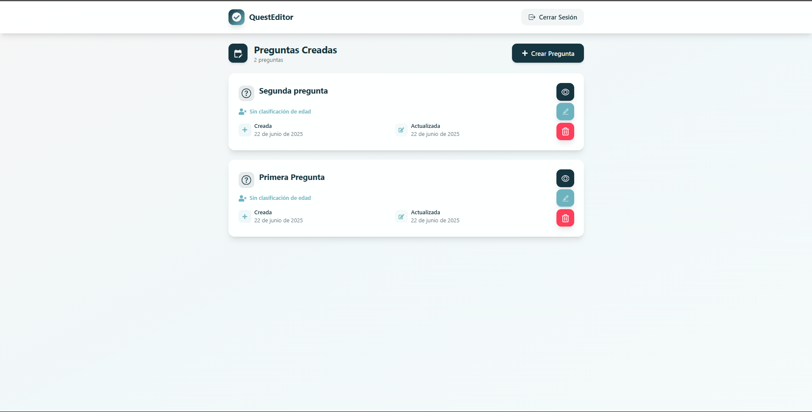
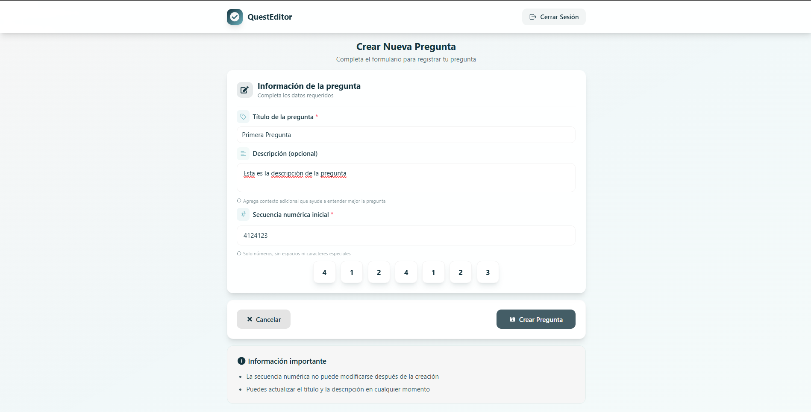
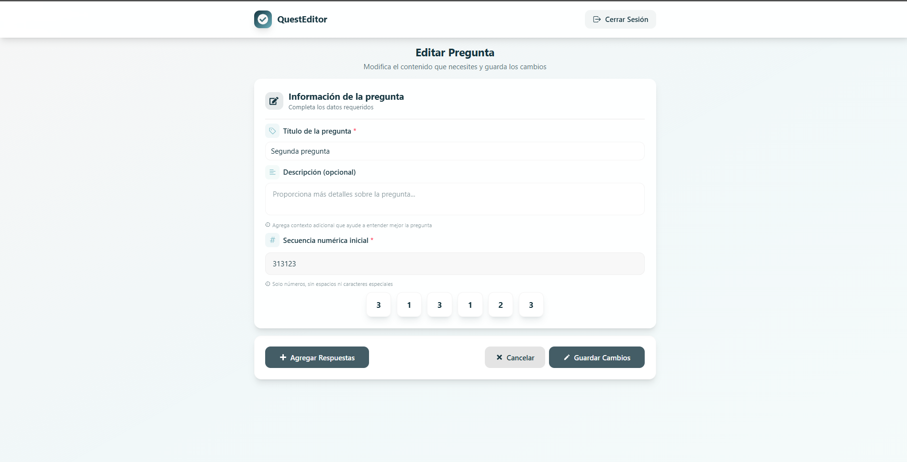
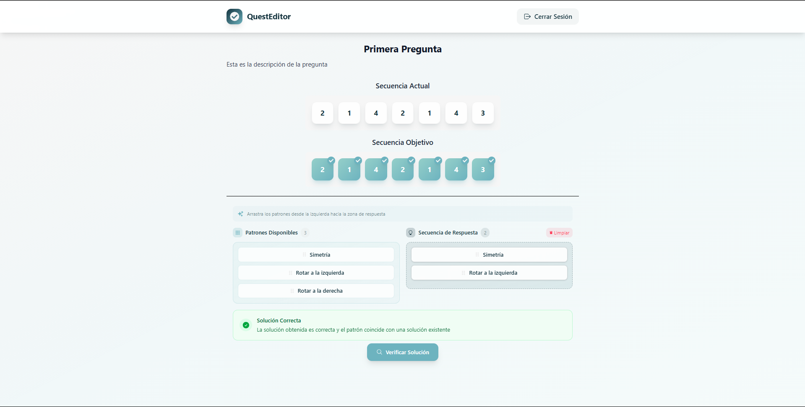
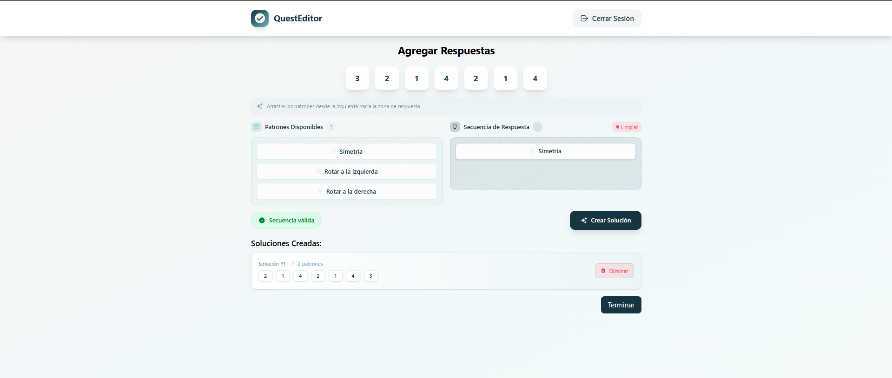
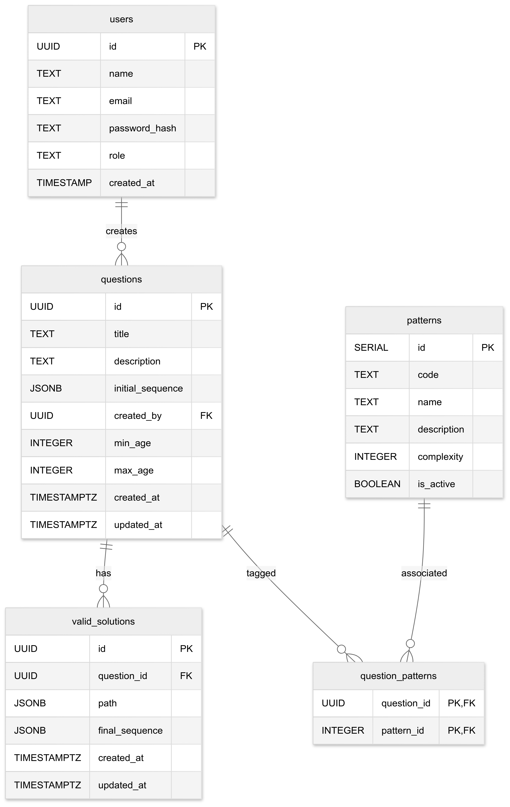

# 🎯 QuestEditor

**QuestEditor** es una plataforma web para la creación y edición de preguntas interactivas basadas en secuencias numéricas. Está diseñada para facilitar a los profesores la elaboración de actividades dinámicas que pueden ser visualizadas desde la perspectiva del estudiante.

Cada pregunta se construye a partir de una secuencia inicial y un conjunto de transformaciones predefinidas, permitiendo generar múltiples soluciones posibles. La herramienta ofrece funcionalidades intuitivas para crear, listar, editar, eliminar y previsualizar preguntas con una experiencia fluida y clara.

---

## 📚 Tabla de Contenidos

- [✨ Características principales](#-características-principales)
- [🛠 Tecnologías utilizadas](#-tecnologías-utilizadas)
- [📸 Capturas de pantalla](#-capturas-de-pantalla)
- [🧩 Diagrama Entidad-Relación (ER)](#-diagrama-entidad-relación-er)
- [🚀 Instalación y configuración](#-instalación-y-configuración)
  - [⚙️ Entorno de desarrollo](#️-entorno-de-desarrollo)
  - [🏁 Entorno de producción](#-entorno-de-producción)

---

## ✨ Características principales

- 🔧 **Gestión completa de preguntas**: crear, listar, editar y eliminar preguntas interactivas.
- 🧠 **Secuencias numéricas dinámicas**: preguntas basadas en transformaciones mediante patrones.
- 🌀 **Múltiples soluciones**: agrega y administra diversas soluciones por pregunta.
- 👀 **Previsualización en tiempo real**: vista previa desde el punto de vista del estudiante.
- 💡 **Interfaz intuitiva**: experiencia centrada en el docente, fácil de usar.
- 📱 **Responsive**: se adapta a distintos dispositivos y tamaños de pantalla.

---

## 🛠 Tecnologías utilizadas

### 🔙 Backend
- [NestJS](https://nestjs.com/) – Framework para aplicaciones escalables con Node.js.
- PostgreSQL 17 – Base de datos relacional potente y robusta.
- Docker & Docker Compose – Contenedorización y orquestación.

### 🔜 Frontend
- [React](https://es.react.dev/) – Biblioteca para construir interfaces de usuario.
- TypeScript – Tipado estático para mejorar la calidad del código.
- Vite – Herramienta de desarrollo y bundling ultrarrápida.

---

## 📸 Capturas de pantalla

### 📄 Listado de preguntas


### ➕ Creación de preguntas


### ✏️ Edición de preguntas


### 👁️ Previsualización


### ✅ Gestión de soluciones


---

## 🧩 Diagrama Entidad-Relación (ER)



---

## 🚀 Instalación y configuración

### Requisitos previos
- **Node.js** v22.16 o superior
- **Docker** y **Docker Compose**
- **Git**

### ⚙️ Entorno de desarrollo

#### 1. Clonar el repositorio
```bash
git clone https://github.com/sae0-3/bit-a-bit.git
cd bit-a-bit
```

#### 2. Configurar base de datos
```bash
cd database
docker compose up -d
```

#### 3. Ejecutar el backend (NestJS)
```bash
cd backend
npm install
npm run start:dev
```

#### 4. Ejecutar el frontend (React + Vite)
```bash
cd frontend
npm install
npm run dev
```

#### 5. Acceder a la aplicación
- **Frontend**: http://localhost:5173
- **Backend**: http://localhost:3000

### 🏁 Entorno de producción

#### 1. Clonar el repositorio
```bash
git clone https://github.com/sae0-3/bit-a-bit.git
cd bit-a-bit
```

#### 2. Ejecutar con Docker Compose
```bash
docker compose up -d --build
```

#### 3. Acceder a la aplicación
- **Frontend**: https://localhost
- **Backend**: https://localhost/api
